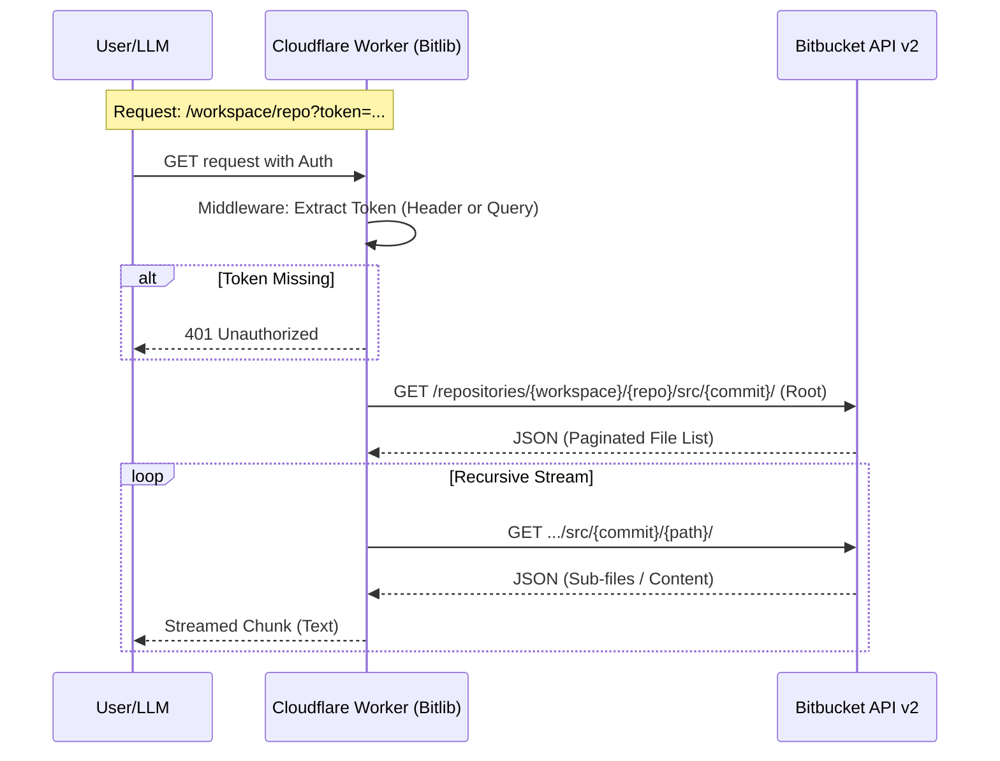

# Bitlib (Bitbucket-to-LLM Proxy) Technical Specification

## 1. Project Overview
Bitlib is a serverless proxy tool designed to fetch, aggregate, and format Bitbucket Cloud repository contents into LLM-friendly formats (concatenated text or JSON).
Modeled after janwilmake/uit (Uithub), this tool adapts the architecture for Bitbucket API v2, focusing on private repository access via a stateless "Hybrid Pass-through" authentication strategy.

### 1.1 Scope
* **Target**: Bitbucket Cloud Repositories (bitbucket.org).
* **Primary User**: LLMs (via context injection), CLI tools, and Developers.
* **Deployment**: Cloudflare Workers (Edge).
* **Privacy**: No data persistence; purely pass-through operations.

---

## 2. Tech Stack

### 2.1 Core Technologies

| Component | Technology | Version | Reason for Selection |
| :--- | :--- | :--- | :--- |
| Runtime | Cloudflare Workers | Latest | 0ms cold start, low cost, aligns with Uithub architecture. |
| Framework | Hono | v4.x | Ultrafast web standard framework optimized for Edge. |
| Language | TypeScript | v5.x | Type safety, specifically for complex API responses. |
| Bitbucket Client | Native Fetch | - | Lightweight. Used with types generated from swagger.v3.json. |
| Type Gen | openapi-typescript | Latest | Auto-generate TS interfaces from the provided Swagger file. |

### 2.2 Infrastructure & Tools
* **Package Manager**: npm or bun
* **Deployment Tool**: wrangler
* **Linter/Formatter**: biome (Fast, modern alternative to ESLint/Prettier)
* **Schema Source**: Fetch official spec from https://api.bitbucket.org/swagger.v3.json during build/init.

---

## 3. Architecture

### 3.1 Directory Structure

```text
bitlib/
├── src/
│   ├── index.ts            # Entry point (Hono app definition)
│   ├── config.ts           # Environment variables & constants
│   ├── types/
│   │   ├── bitbucket-schema.d.ts # Generated from swagger.v3.json
│   │   └── index.ts        # Internal type definitions
│   ├── services/
│   │   └── bitbucket.ts    # Bitbucket API Client & Logic
│   ├── middlewares/
│   │   └── auth.ts         # Header/Query token extraction
│   └── utils/
│       └── ignore.ts       # .gitignore / .genignore pattern matching
├── wrangler.toml           # Cloudflare Workers config
├── swagger.v3.json         # Reference API spec (fetched from official source)
└── package.json
```

### 3.2 Data Flow (Sequence Diagram)



---

## 4. Features & Requirements

### 4.1 Functional Requirements

**Priority: Must Have**
* **Repository Traversal**:
    * Recursively fetch all files in a repository (handling Bitbucket's pagination).
    * Support explicit path access (e.g., specific subfolder).
* **Hybrid Pass-through Authentication**:
    * Accept OAuth Token via `Authorization: Bearer <token>` header.
    * Accept App Password via `Authorization: Basic <base64>` header.
    * **Crucial**: Accept `?token=<token>` query parameter and convert it to the appropriate Authorization header internally (for LLM ease of use). **Note**: This is conditional; `?token` must only be converted when the runtime flag `ALLOW_QUERY_AUTH` is enabled (set to "true"). If `ALLOW_QUERY_AUTH` is false or undefined, `?token` is ignored/rejected to prevent credential leakage.
* **Output Formats**:
    * **Text (Default)**: Streamed concatenated file contents with headers.
      ```text
      File: filename.ts
      ================================================================
      ```
    * **JSON**: Structured JSON object representing the file tree and contents. (Note: JSON output currently does not support streaming).
* **Branch Support**:
    * Default to `main` or `master` if unspecified.
    * Allow overrides via `?branch=<branch_name>`.

**Priority: Should Have**
* **File Filtering**:
    * Ignore standard binary files (images, PDFs).
    * Respect `.gitignore` or a custom `.genignore` mechanism to reduce token usage.
    * **Default Ignore Patterns**: `.git/`, `node_modules/`, `.DS_Store`, `Thumbs.db`, `.env*`, `package-lock.json`, `yarn.lock`, `bun.lockb`, `dist/`, `build/`.
* **Error Handling**:
    * Clear error messages for 404 (Repo not found) and 401 (Auth failed).

### 4.2 Endpoint Definition
`GET /:workspace/:repo_slug/:path{*}`

* **Path Params**:
    * `workspace`: Bitbucket Workspace ID.
    * `repo_slug`: Repository Name.
    * `path`: (Optional) Specific directory or file path. Defaults to root.
* **Query Params**:
    * `token`: (Optional) Bitbucket Access Token (App Password or OAuth Token).
    * `user`: (Optional) Username (required only if using App Password via query param, though Basic Header is preferred).
    * `branch`: (Optional) Branch name or Commit hash. Defaults to repo's main branch.
    * `format`: `text` (default) or `json`.
    * `ignore`: Comma-separated list of patterns to ignore (e.g., `*.lock,dist/`).

---

## 5. Implementation Logic & Constraints

### 5.1 Bitbucket API Specifics
Unlike GitHub's Git Data API (which can fetch a whole tree in one go), Bitbucket's API structure is strictly folder-based.

* **Endpoint**: `/repositories/{workspace}/{repo_slug}/src/{commit}/{path}`
* **Challenge**: This endpoint returns a paginated list of immediate children only.
* **Strategy**:
    1.  Fetch root directory.
    2.  Identify entries with `type: "directory"`.
    3.  Recursively fetch those directories (using `Promise.all` with a concurrency limit to avoid rate limits).
    4.  Identify entries with `type: "commit_file"`.
    5.  Fetch raw content (Bitbucket redirects to a raw asset link, or serves text directly).

### 5.2 Authentication Logic (Middleware)
The middleware must normalize authentication into a standard Header for outgoing requests.

```typescript
// Pseudocode Logic
function getAuthHeader(c: Context) {
  const headerAuth = c.req.header('Authorization');
  if (headerAuth) return headerAuth;

  const queryToken = c.req.query('token');
  const queryUser = c.req.query('user');

  // Case: OAuth Token in query
  if (queryToken && !queryUser) {
    return `Bearer ${queryToken}`;
  }
  
  // Case: App Password in query
  if (queryToken && queryUser) {
    return `Basic ${btoa(queryUser + ":" + queryToken)}`;
  }

  return null; // 401 Logic later
}
```

### 5.3 Output Formatting
Text mode utilizes Hono's `streamText` to deliver content efficiently as it's fetched from Bitbucket. This minimizes memory overhead for large repositories.

**Format Pattern**:
Files are separated by a delimiter containing the full path.

```text
File: path/to/file.ts
================================================================
import { Hono } from 'hono';
... content ...
```

### 5.4 Deployment Configuration (wrangler.toml)
* **Name**: bitlib
* **Compatibility Date**: 2024-04-01 (or current)
* **Compatibility Flags**: `["nodejs_compat"]`

---

## 6. LLM Guidelines (For Code Generation)
When asking an AI (Cursor/Windsurf) to implement this, use the following prompts:

1.  **Type Generation First**:
    "Fetch the official Swagger spec from https://api.bitbucket.org/swagger.v3.json and save it. Then, generate TypeScript interfaces using openapi-typescript. Focus on the /repositories/{workspace}/{repo_slug}/src endpoints and paginated_files schemas."
2.  **Bitbucket Client**:
    "Create a BitbucketClient class that wraps fetch. It must handle pagination for the /src endpoint automatically (using the next link in the JSON response) and recursive directory traversal."
3.  **Concurrency Control**:
    "When fetching file contents recursively, use a batching mechanism (e.g., p-limit or chunked Promise.all) to avoid hitting Cloudflare Workers' simultaneous connection limits or Bitbucket rate limits."
4.  **Streaming**:
    "Since repositories can be large, ensure the Hono response uses streamText where possible, or builds the large string efficiently to avoid memory limits."
